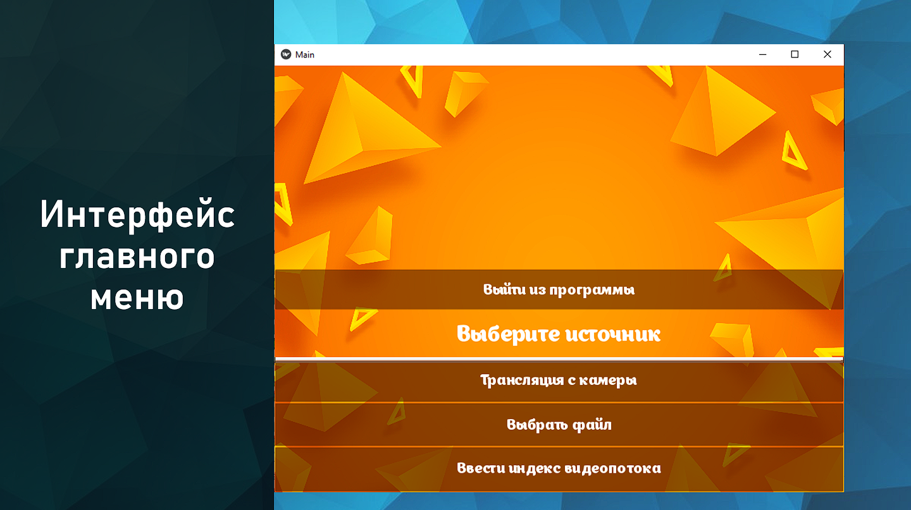
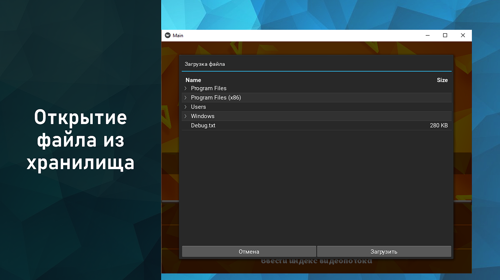
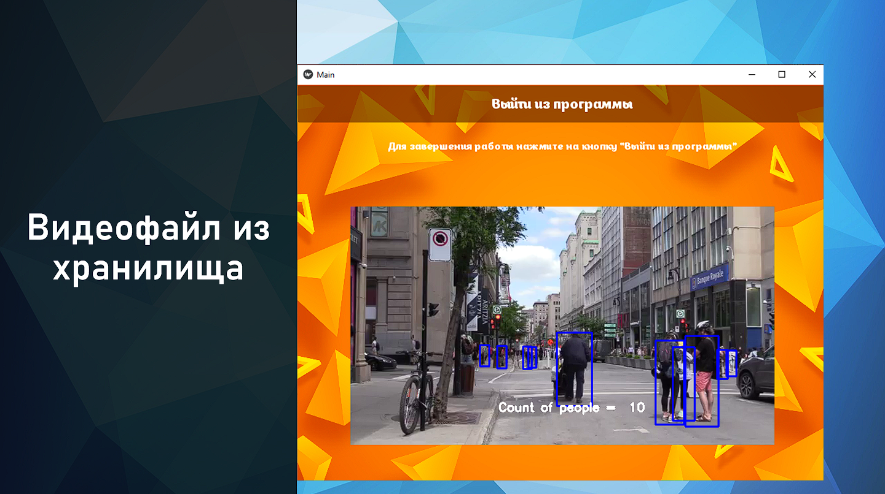
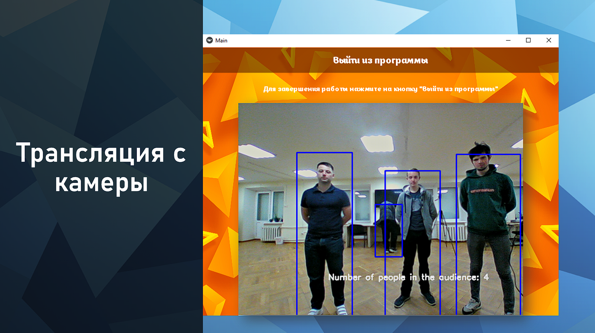

#  ПО для распознавания и подсчёта студентов в аудитории

<div  align="center">
    <h1>RLP</h1>
    <p>
        <a  href="#">
            
        </a>
    </p>
</div>

___

## Что это?

Это репозиторий, который мы используем для хранения наших знаний, полученных в ходе проектной деятельности.


## Как этим пользоваться

Для корректной работы требуется установка всех нужных зависимостей

```bash
$ python -m pip install -r requirements.txt
```

## Интерфейс
<p>
    <a  href="#">
        
    </a>
    <a  href="#">
        
        </a>
    <a  href="#">
        
    </a>
    <a  href="#">
        
    </a>
</p>

## Возникли проблемы 
Если у вас возникают какие-то ошибки при использование скриптов, которые находятся в _этом репозитории_, в этом случае вы можете получить иструкцию по решению этой ошибки в [решение проблем]( https://www.google.ru/ "решение ошибок").
